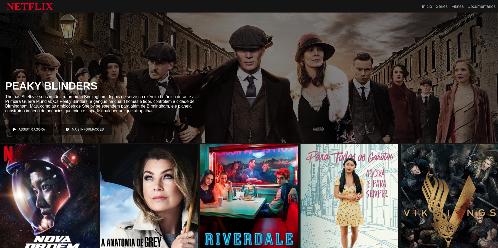

<h1>Interface NETFLIX </h1>

## 💻 __Tecnologias__ 

* HTML
* CSS
* JS
* JQUERY

## 🗒️ __Sobre__

Esse projeto em um exercício da [DIO](https://digitalinnovation.one/), com o intuito de desenvolveruma réplica da página de seleção de filmes da NETFLIX.

Nesse projeto foi usada a biblioteca jQuery para desenvolver um carrosel na seleção de filmes.